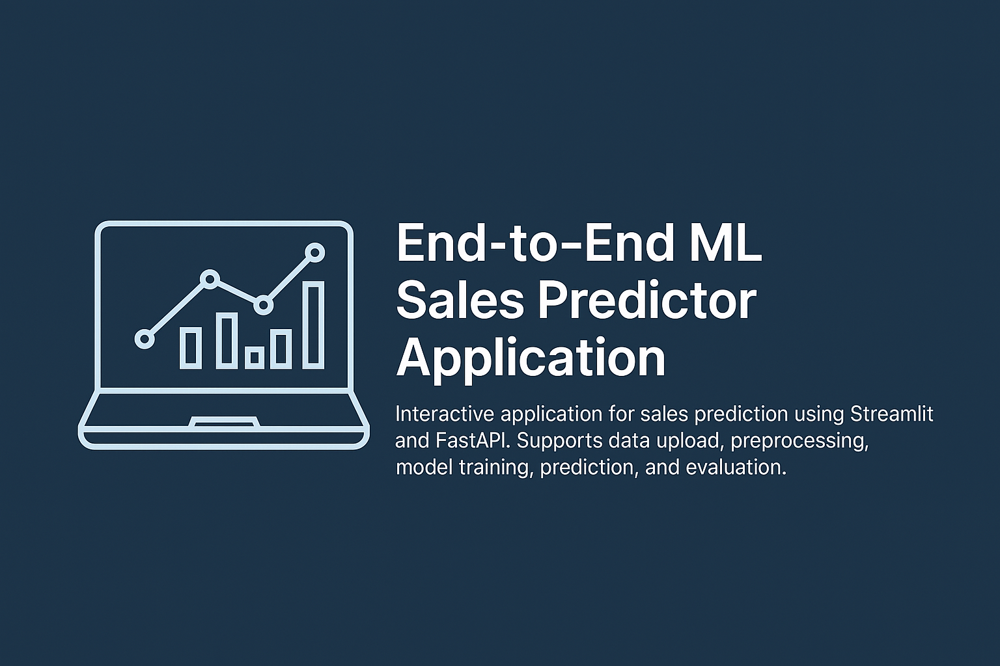

# 📈 End-to-End ML Sales Predictor Application





---


## 🎯 Application Features

- **Interactive Data Upload**: Users can effortlessly upload their own datasets.
- **Automated Data Preprocessing**: Clean and preprocess data for training or inference.
- **Multiple Regression Models**: Train and compare various models like Linear Regression, Decision Tree, Random Forest, SVR, and K-Neighbors Regressor.
- **Instant Predictions**: Generate predictions based on real-time user input.
- **Model Evaluation**: Easily visualize model performance metrics (MAE, MSE, R²).

---

## 📂 Project Structure
```
src/
└── salespredictor/
    ├── api/
    ├── components/
    │   ├── data_ingestion.py
    │   ├── data_processing.py
    │   ├── model_training.py
    │   └── model_inference.py
    ├── dashboard/
    ├── pipeline/
    ├── utils/
    └── __init__.py
requirements.txt
setup.py
README.md
```

---

## ⚙️ Installation

### **1. Clone the Repository**

```bash
git clone git@github.com:Anand-puthiyapurayil/AI_Sales_Project.git
cd AI_Sales_Project
```

### **2. Set Up the Environment**

Create and activate a virtual environment:
```bash
python -m venv venv
source venv/bin/activate  # Linux/Mac
venv\Scripts\activate     # Windows
```

Install dependencies:
```bash
pip install -r requirements.txt
```

---

## 🚀 Running the Application

### **Run Streamlit Interface**
```bash
streamlit run src/salespredictor/dashboard/app.py
```

### **Start FastAPI Backend**
```bash
uvicorn src.salespredictor.api.main:app --reload
```

---

## 💡 How to Use

1. **Ingest Data**: Upload your CSV file via Streamlit and preprocess.
2. **Train Models**: Select to train multiple models with your data.
3. **Make Predictions**: Input real-time data to get instant predictions.
4. **Evaluate**: View detailed metrics and performance visuals of your trained models.

---

## 🛠️ Technology Stack

- **Frontend**: Streamlit
- **Backend**: FastAPI, Uvicorn
- **Machine Learning Libraries**: Scikit-learn, Pandas, NumPy, Joblib
- **Visualization**: Matplotlib, Seaborn

---

## 📜 License

Distributed under the MIT License.

---

## 🤝 Contributions

Contributions are welcome! To contribute:

- Fork the repository.
- Create a new feature branch (`git checkout -b feature/my-feature`).
- Commit your changes (`git commit -m 'Add feature'`).
- Push your branch (`git push origin feature/my-feature`).
- Open a Pull Request.

---

## 📞 Contact

- **Email**: [anand.nelliot@gmail.com](mailto:anand.nelliot@gmail.com)
- **LinkedIn**: [Anand Puthiyapurayil](https://www.linkedin.com/in/anand-p-/)

Happy Predicting! 🚀✨
